# Document Workflow Agent - Development Plan

**Purpose:** Develop an autonomous Playwright MCP agent that explores the eNow2 application and maintains documentation by identifying gaps, exploring workflows, generating Mermaid diagrams, and updating documentation files.

---

## Overview

```mermaid
flowchart TD
    subgraph Input
        A[/latex/ Role Wikis]
        B[workflow-diagrams.md]
        C[project-wiki.md]
    end

    subgraph Agent Loop
        D[1. Identify Documentation Gap]
        E[2. Explore Application via Playwright MCP]
        F[3. Generate/Update Mermaid Diagrams]
        G[4. Write/Update Documentation]
        H[5. Validate & Commit]
    end

    subgraph Output
        I[Updated workflow-diagrams.md]
        J[Updated Role Documentation]
        K[Agent Execution Log]
    end

    A --> D
    B --> D
    C --> D
    D --> E
    E --> F
    F --> G
    G --> H
    H -->|Next Area| D
    H --> I
    H --> J
    H --> K
```

---

## Agent Architecture

### Core Files

```
docs/
├── agent/                           # Agent configuration and outputs
│   ├── agent-config.md              # Agent configuration settings
│   ├── exploration-queue.md         # Queue of documentation areas to explore
│   ├── exploration-log.md           # Log of agent activities
│   └── screenshots/                 # Screenshots captured during exploration
├── latex/
│   ├── workflow-diagrams.md         # Primary output: Mermaid diagrams
│   ├── project-wiki.md              # Primary input: Documentation structure
│   ├── admin-role.md                # Role documentation (input/output)
│   ├── provider-role.md
│   ├── patient-role.md
│   ├── coordinator-role.md
│   └── device-role.md
```

---

## Agent Workflow Phases

### Phase 1: Documentation Gap Analysis

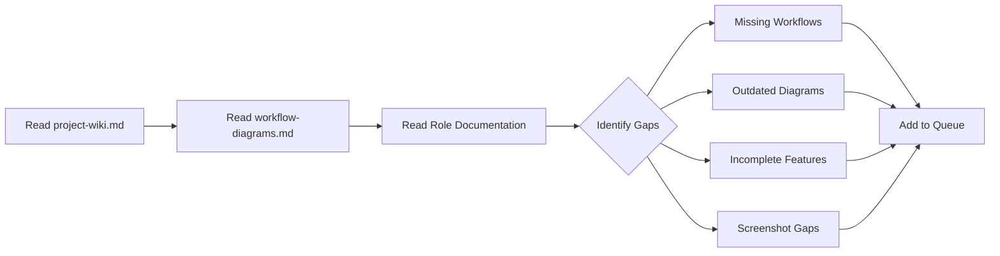

**Agent Actions:**

1. Parse `project-wiki.md` to understand documented features
2. Parse `workflow-diagrams.md` to see existing Mermaid diagrams
3. Cross-reference with role documentation to find:
   - Features mentioned but not diagrammed
   - Diagrams without corresponding documentation
   - TODOs or "Coming Soon" markers
   - Stale dates or version mismatches

**Output:** `exploration-queue.md` - prioritized list of documentation tasks

---

### Phase 2: Application Exploration (Playwright MCP)

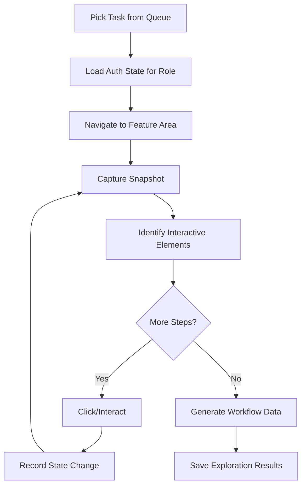

**Playwright MCP Tools Used:**

- `browser_navigate` - Navigate to application pages
- `browser_snapshot` - Capture accessibility snapshots
- `browser_click` - Interact with elements
- `browser_take_screenshot` - Visual documentation
- `browser_fill_form` - Fill form fields for workflow testing

**Agent Behaviors:**

1. **Role Context:** Load appropriate auth state before exploration
2. **Systematic Navigation:** Follow sidebar navigation structure
3. **Interaction Recording:** Log each click, state change, and URL
4. **Screenshot Capture:** At each workflow step for documentation
5. **Accessibility Mapping:** Use snapshots to understand element structure

---

### Phase 3: Mermaid Diagram Generation

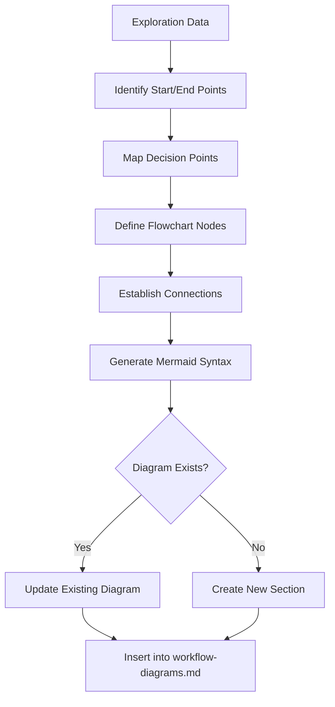

**Diagram Types:**

- `flowchart TD` - Vertical workflow flows
- `flowchart LR` - Horizontal navigation maps
- `sequenceDiagram` - Multi-user interactions
- `stateDiagram-v2` - State transitions

**Naming Convention:**

````markdown
## {Category Number}. {Category Name} Workflows

### {Category}.{Number} {Workflow Name}

> See screenshots: `workflow-{name}-*.png`

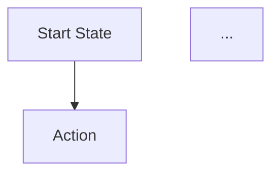
````

---

### Phase 4: Documentation Update

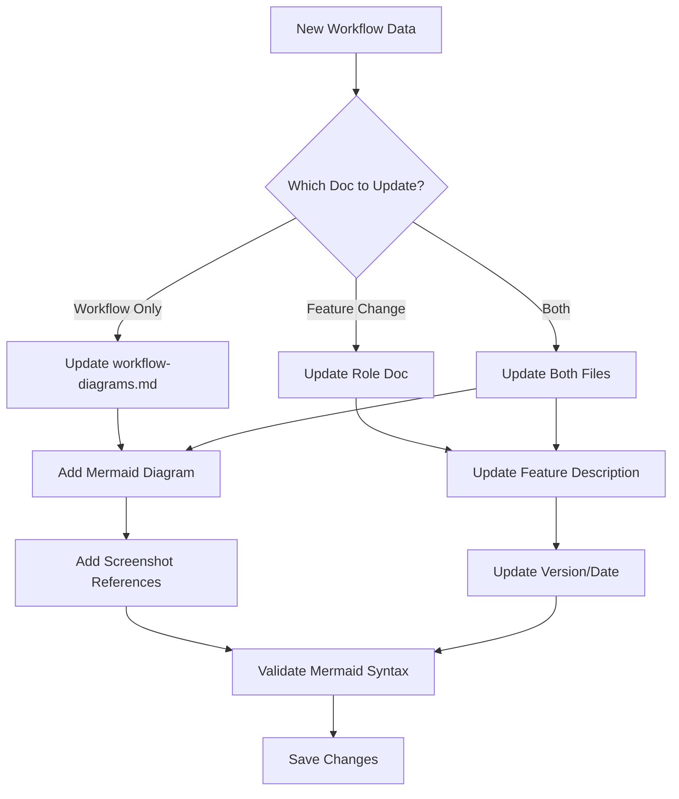

**Documentation Standards:**

1. **Version Update:** Increment version, update "Last Updated" date
2. **Screenshot References:** Add `> See screenshots: workflow-*.png` markers
3. **Cross-References:** Link between role docs and workflow diagrams
4. **Consistent Formatting:** Follow existing markdown structure

---

### Phase 5: Validation & Completion

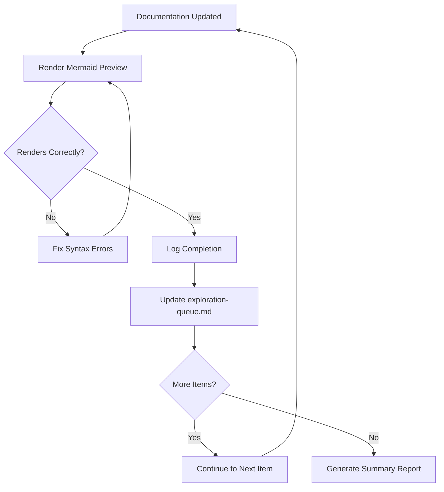

---

## Agent Configuration

### exploration-queue.md Format

```markdown
# Documentation Exploration Queue

## Priority: High

- [ ] Admin > Institution Settings > White Label Tab (undocumented)
- [ ] Provider > Calendar Integrations workflow (incomplete diagram)
- [ ] Coordinator > Command Center WebSocket updates (missing)

## Priority: Medium

- [ ] Patient > Vitals Scan error states
- [ ] Device > Session timeout behavior

## Priority: Low

- [ ] Update all screenshots to latest UI

## Completed

- [x] Admin > Users > Invite workflow (2026-03-01)
```

### exploration-log.md Format

````markdown
# Agent Exploration Log

## Session: 2026-03-01 10:30:00

### Task: Admin > Institution Settings > White Label

**Role:** admin
**URL:** /dashboard/institution-settings?tab=white-label

#### Steps Recorded:

1. Navigated to Institution Settings
2. Clicked White Label tab
3. Found: Logo upload, Color picker, Custom CSS
4. Captured: 3 screenshots

#### Mermaid Generated:

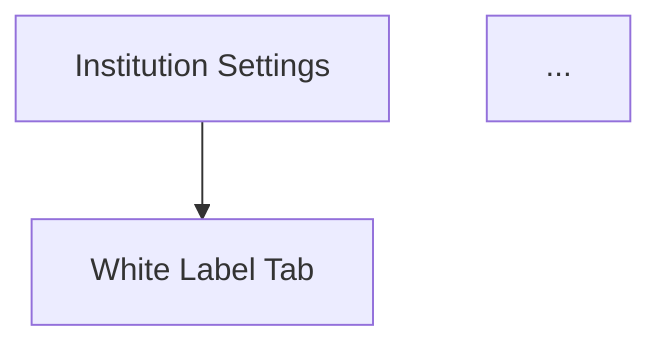
````

#### Documentation Updated:

- workflow-diagrams.md: Added section 3.6
- admin-role.md: Updated White Label section

---

````

---

## Playwright MCP Integration

### Required MCP Tools

```mermaid
flowchart LR
    subgraph Navigation
        N1[browser_navigate]
        N2[browser_navigate_back]
    end

    subgraph Interaction
        I1[browser_click]
        I2[browser_fill_form]
        I3[browser_select_option]
        I4[browser_press_key]
    end

    subgraph Capture
        C1[browser_snapshot]
        C2[browser_take_screenshot]
    end

    subgraph State
        S1[browser_tabs]
        S2[browser_wait_for]
    end
````

### Authentication Strategy

```mermaid
flowchart TD
    A[Agent Starts] --> B[Read Task Role]
    B --> C{Role Type?}
    C -->|Admin| D[Load admin.json]
    C -->|Provider| E[Load provider.json]
    C -->|Patient| F[Load patient.json]
    C -->|Coordinator| G[Load coordinator.json]
    C -->|Device| H[Load device.json]
    D --> I[Navigate to QA URL]
    E --> I
    F --> I
    G --> I
    H --> I
    I --> J[Begin Exploration]
```

### Example Exploration Script

```javascript
// Pseudocode for agent exploration logic
async function exploreFeature(role, featurePath) {
  // 1. Navigate to feature
  await mcp.browser_navigate({ url: `${QA_URL}${featurePath}` });

  // 2. Take snapshot for accessibility tree
  const snapshot = await mcp.browser_snapshot();

  // 3. Identify clickable elements
  const elements = parseSnapshot(snapshot);

  // 4. For each element, explore
  for (const element of elements) {
    await mcp.browser_click({ element: element.ref });
    await mcp.browser_take_screenshot({
      filename: `workflow-${role}-${element.name}.png`,
    });
    // Record state change
    recordWorkflowStep(element.name, snapshot);
  }

  // 5. Generate Mermaid from recorded steps
  return generateMermaidDiagram(steps);
}
```

---

## Implementation Phases

### Phase 1: Foundation (Week 1)

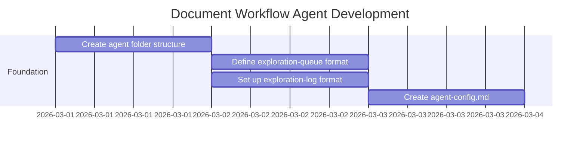

**Deliverables:**

- `docs/agent/` folder created
- Configuration files templated
- Initial queue populated from gap analysis

### Phase 2: MCP Integration (Week 2)

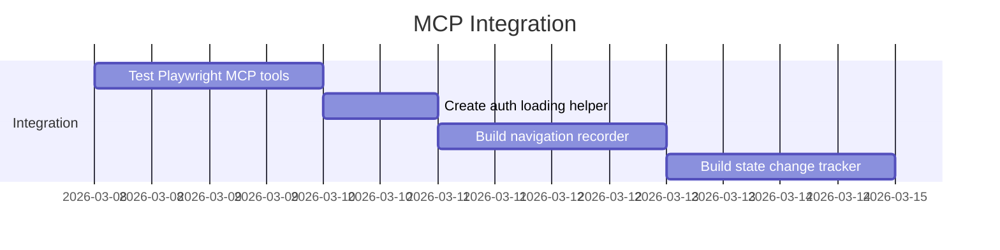

**Deliverables:**

- Working MCP tool chain
- Auth state integration
- Basic navigation recording

### Phase 3: Mermaid Generation (Week 3)

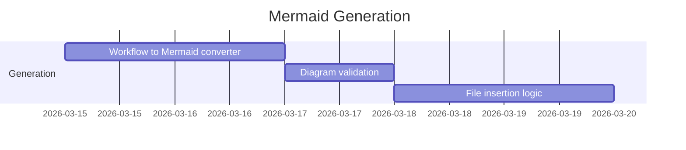

**Deliverables:**

- Automatic Mermaid generation from exploration
- Syntax validation
- Smart file insertion

### Phase 4: Documentation Writer (Week 4)

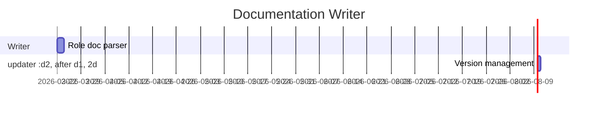

**Deliverables:**

- Automatic role documentation updates
- Section-aware editing
- Version/date management

### Phase 5: Full Loop (Week 5)

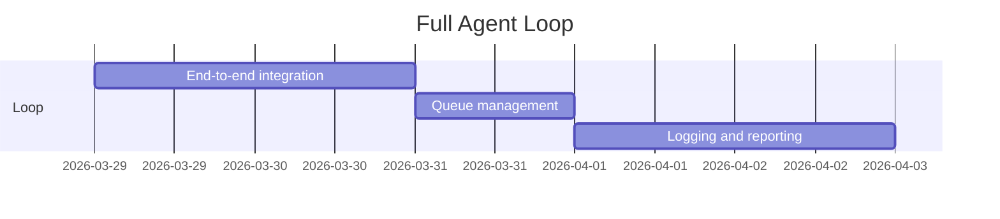

**Deliverables:**

- Complete agentic loop
- Automatic queue progression
- Summary reporting

---

## Success Criteria

### Quantitative

- [ ] Agent can explore all 5 role navigation menus
- [ ] Agent generates valid Mermaid diagrams (syntax validated)
- [ ] Agent updates documentation with correct markdown formatting
- [ ] 100% of diagrams render in GitHub/VS Code preview

### Qualitative

- [ ] Generated documentation matches manual exploration
- [ ] Mermaid diagrams accurately represent workflows
- [ ] Agent logs are clear and actionable
- [ ] Minimal human intervention required

---

## Risks & Mitigations

| Risk                         | Impact | Mitigation                                      |
| ---------------------------- | ------ | ----------------------------------------------- |
| UI changes break exploration | High   | Use accessibility snapshots, not pixel matching |
| Auth tokens expire           | Medium | Refresh auth before each session                |
| Mermaid syntax errors        | Low    | Validate before writing; fix loop               |
| Agent infinite loops         | High   | Max step limits; visited state tracking         |
| Screenshot bloat             | Low    | Only capture at workflow milestones             |

---

## Appendix: File Templates

### agent-config.md

```markdown
# Agent Configuration

## Application

- URL: https://portal.qa-encounterservices.com
- Auth Directory: playwright/.auth/

## Exploration Settings

- Max Steps Per Feature: 20
- Screenshot on State Change: true
- Snapshot Interval: After each click

## Roles to Explore

- [x] admin
- [x] provider
- [x] patient
- [x] coordinator
- [x] device

## Output Settings

- Diagrams: docs/latex/workflow-diagrams.md
- Logs: docs/agent/exploration-log.md
- Screenshots: docs/agent/screenshots/
```

### exploration-queue.md (Initial)

```markdown
# Exploration Queue

## Auto-generated: 2026-03-01

### High Priority (Missing Workflows)

- [ ] Admin > Document Management > Create Template
- [ ] Admin > Data Reporting > Export Report
- [ ] Provider > My Patients > Add Patient
- [ ] Coordinator > Command Center > Session Monitoring

### Medium Priority (Incomplete)

- [ ] Patient > Health Profile > All Fields
- [ ] Device > Error States

### Low Priority (Updates)

- [ ] Verify all existing diagrams
- [ ] Update screenshots
```

---

## Next Steps

1. **Review this plan** - Confirm approach aligns with goals
2. **Create agent folder** - Set up `docs/agent/` structure
3. **Populate initial queue** - Gap analysis of current documentation
4. **Test MCP tools** - Verify Playwright MCP is available and working
5. **Iterate** - Build and test each phase incrementally
