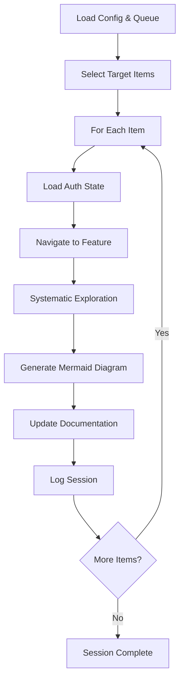

# Document Workflow Agent

**Autonomous documentation generator for eNow2 Playwright QA project**

---

## Quick Start

```bash
# 1. Test MCP integration
node docs/agent/test-mcp.js

# 2. Run gap analysis (dry run)  
node docs/agent/agent.js --mode=gap --dry-run

# 3. Execute high priority documentation 
node docs/agent/agent.js --mode=gap
```

---

## Files

| File | Purpose |
|------|---------|
| `agent.js` | Main agent execution script |
| `test-mcp.js` | MCP integration testing |
| `agent-config.md` | Agent configuration settings |
| `exploration-queue.md` | Queue of documentation tasks (27 items) |
| `exploration-log.md` | Session history and results |
| `package.json` | Node.js dependencies and scripts |
| `screenshots/` | Captured screenshots during exploration |

---

## Execution Modes

### Gap Mode (Recommended Start)
```bash
node docs/agent/agent.js --mode=gap
```
- Focuses on High Priority items (8 items)
- Missing critical workflows and features
- ~2-3 hour execution time

### Role-Focused Mode
```bash  
node docs/agent/agent.js --mode=role-focused --role=admin
node docs/agent/agent.js --mode=role-focused --role=provider
# ...etc for each role
```
- Explores all features for a specific role
- Good for deep-dive documentation

### Refresh Mode
```bash
node docs/agent/agent.js --mode=refresh
```
- Updates existing documentation only
- Faster execution (~30 minutes)
- Re-captures screenshots, updates diagrams

### Full Mode
```bash
node docs/agent/agent.js --mode=full --max-duration=240
```
- Explores all 27 queued items
- 4+ hour execution time
- Complete documentation overhaul

---

## Options

| Option | Description | Example |
|--------|-------------|---------|
| `--mode=MODE` | Execution mode | `gap`, `role-focused`, `refresh`, `full` |
| `--role=ROLE` | Target role (for role-focused) | `admin`, `provider`, `patient`, `coordinator`, `device` |
| `--max-duration=MINUTES` | Time limit in minutes | `60`, `120`, `240` |
| `--dry-run` | Simulate without making changes | No value needed |

---

## Prerequisites

### 1. Authentication Setup
```bash
# Run auth setup for all roles
npx playwright test tests/setup/
```
Creates storage states in `playwright/.auth/`:
- `admin.json`, `provider.json`, `patient.json`, `coordinator.json`, `device.json`
- Plus combined roles and secondary accounts

### 2. MCP Integration  
- Playwright MCP extension installed in VS Code
- MCP tools available: `mcp_playwright_browser_*`

### 3. Environment
```bash
# Install dependencies
npm install
```

---

## Agent Workflow



---

## Generated Artifacts

### 1. Mermaid Diagrams
- Added to `docs/latex/workflow-diagrams.md`
- Flowcharts for each explored workflow
- Proper sectioning and cross-references

### 2. Screenshots  
- Saved to `docs/agent/screenshots/`
- Naming: `workflow-{role}-{feature}-{step}.png`
- Referenced in documentation

### 3. Documentation Updates
- Role-specific docs updated with new workflows
- Version numbers incremented  
- "Last Updated" dates refreshed

### 4. Session Logs
- Detailed exploration logs in `exploration-log.md`
- Performance metrics and error tracking
- Queue completion status

---

## Queue Management

### Current Queue (27 items)
- **High Priority:** 8 missing critical workflows
- **Medium Priority:** 13 incomplete features/edge cases  
- **Low Priority:** 6 documentation improvements

### Adding Items
Edit `exploration-queue.md`:
```markdown
- [ ] **role/feature/area** - Description of what needs documentation
```

### Priority Levels
- **High:** Missing core functionality (blocks users)
- **Medium:** Incomplete workflows or edge cases
- **Low:** Nice-to-have updates, UI refreshes

---

## Troubleshooting

### MCP Tools Not Available
```bash
# Test MCP integration
node docs/agent/test-mcp.js

# Fix: Install Playwright MCP extension in VS Code
# Verify MCP server is running
```

### Auth Files Missing
```bash  
# Run auth setup
npx playwright test tests/setup/

# Verify files created
ls playwright/.auth/
```

### Navigation Errors
- Check `QA_URL` environment variable
- Verify application is accessible
- Check network connectivity

### Mermaid Syntax Errors
- Agent validates Mermaid before writing
- Check console logs for syntax issues
- Manual fix in workflow-diagrams.md if needed

---

## Development

### Extending the Agent

1. **Add new MCP tools** - Update `exploreFeatureSystematically()`
2. **Custom workflows** - Extend `navigateToFeature()` mapping
3. **New documentation formats** - Extend `updateDocumentation()`
4. **Better element detection** - Improve accessibility parsing

### Configuration Changes
- Edit `agent-config.md` YAML blocks
- Agent reloads config on each run
- No code changes needed for most settings

---

## Example Output

After running `--mode=gap`, expect:

```
📊 Added diagram to workflow-diagrams.md: Admin Institution Settings White Label
📋 Updated role documentation: admin-role.md  
📅 Updated version information
✅ Items Completed: 8
📸 Screenshots: 32
📊 Diagrams: 8  
📝 Docs Updated: 8
```

Files modified:
- `docs/latex/workflow-diagrams.md` - 8 new Mermaid diagrams
- `docs/latex/admin-role.md` - Updated sections
- `docs/latex/coordinator-role.md` - Command Center workflows
- `docs/latex/provider-role.md` - Calendar integration flows
- Version increments across all role documentation

---

## Support 

For issues or questions:
1. Check `exploration-log.md` for error details
2. Run with `--dry-run` to test without changes  
3. Use `test-mcp.js` to verify environment
4. Review queue items in `exploration-queue.md`