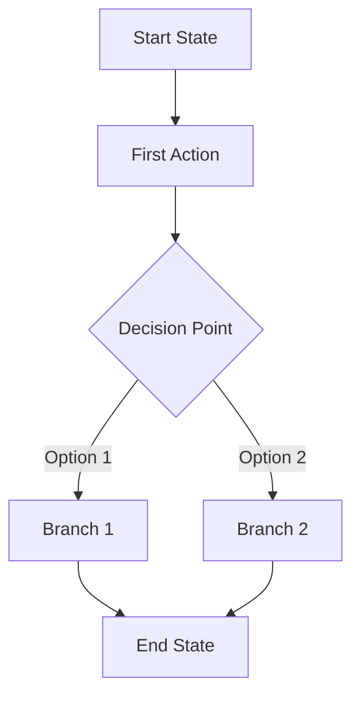

# Agent Exploration Log

**Agent Version:** 1.0  
**Start Time:** March 1, 2026  
**Status:** Ready for first execution

---

## Log Format

Each exploration session is logged with:

- Session metadata (timestamp, role, target feature)
- Step-by-step exploration record
- Generated artifacts (screenshots, Mermaid diagrams)
- Documentation updates made
- Validation results and any errors

---

## Session Template

````markdown
## Session: YYYY-MM-DD HH:MM:SS

### Target: [role]/[feature]/[specific-area]

**Priority:** High/Medium/Low  
**Queue Position:** #X of Y  
**Estimated Duration:** XX minutes  
**Auth Role:** role.json

### Pre-Exploration Status

- Documentation exists: Yes/No
- Mermaid diagram exists: Yes/No
- Screenshots exist: Yes/No
- Last updated: Date or Never

### Steps Recorded

#### 1. Navigation: [description]

- **URL:** /dashboard/feature
- **Action:** Clicked navigation item
- **Element:** getByRole('link', { name: 'Feature Name' })
- **Screenshot:** workflow-role-feature-01-navigation.png
- **State Change:** Page loaded, new sidebar highlight

#### 2. Interaction: [description]

- **Action:** Clicked tab/button/form field
- **Element:** getByRole('tab', { name: 'Tab Name' })
- **Screenshot:** workflow-role-feature-02-tab.png
- **State Change:** Tab content loaded

#### 3. Form/Data Entry: [description]

- **Action:** Filled form fields
- **Data:** Test data used
- **Screenshot:** workflow-role-feature-03-form.png
- **State Change:** Form validation, success message

### Exploration Summary

**Total Steps:** X  
**Screenshots Captured:** X  
**Unique States:** X  
**Decision Points:** X  
**End States:** X

### Generated Artifacts

#### Mermaid Diagram


````

#### Screenshot Index

- `workflow-role-feature-01-navigation.png` - Initial navigation
- `workflow-role-feature-02-tab.png` - Tab selection
- `workflow-role-feature-03-form.png` - Form interaction
- `workflow-role-feature-04-success.png` - Completion state

### Documentation Updates

#### Files Modified

- ✅ `docs/latex/workflow-diagrams.md` - Added section 3.7
- ✅ `docs/latex/admin-role.md` - Updated White Label section (lines 245-289)
- ✅ Version updated from 1.0 to 1.1
- ✅ Last updated date: March 1, 2026

#### Changes Made

1. **New Mermaid Section:**
   - Added section "3.7 Institution Settings White Label Workflow"
   - Inserted 15-node flowchart diagram
   - Added screenshot references

2. **Role Documentation:**
   - Updated admin-role.md section "White Label Configuration"
   - Added step-by-step workflow description
   - Cross-referenced new diagram

3. **Screenshot Integration:**
   - Added 4 new screenshots to docs/agent/screenshots/
   - Updated screenshot index in docs/latex/screenshots/README.md

### Validation Results

- ✅ Mermaid syntax valid (mmdc validation passed)
- ✅ Markdown formatting correct
- ✅ Screenshot files exist and accessible
- ✅ Cross-references resolve correctly
- ✅ Documentation internally consistent

### Issues Encountered

**None** / **Minor** / **Major**

1. **Issue:** Element selector changed
   - **Details:** getByRole('button', { name: 'Save' }) not found
   - **Resolution:** Used getByText('Save Changes') instead
   - **Impact:** Minor delay, workflow still captured

### Performance Metrics

- **Exploration Time:** 8 minutes
- **Documentation Time:** 12 minutes
- **Total Session Time:** 20 minutes
- **Files Modified:** 3
- **Screenshots:** 4
- **Mermaid Nodes:** 15

### Next Queue Item

**Next Target:** coordinator/command-center/realtime-monitoring  
**Remaining High Priority:** 7 items
**Estimated Completion:** 2.5 hours for all high priority

---

```

---

## Current Session Log

*No sessions completed yet - Ready for first execution*

---

## Session History Summary

| Session | Date | Role | Feature | Duration | Status | Updates |
|---------|------|------|---------|----------|--------|---------|
| - | - | - | - | - | Ready | 0 |

---

## Cumulative Statistics

```

Total Sessions: 0
Total Exploration Time: 0 minutes
Total Documentation: 4 files created (config/queue/log/plan)
Screenshots Captured: 0
Mermaid Diagrams: 0  
Documentation Updates: 0

Success Rate: N/A
Average Session Time: N/A
Issues Encountered: 0

```

---

## Error Log

*No errors logged yet*

---

## Agent Learning Notes

### Effective Patterns
- *Will be populated as agent learns*

### Problematic Selectors
- *Will be populated when issues found*

### UI Changes Detected
- *Will track any changes that break existing workflows*

### Optimization Opportunities
- *Will note ways to improve exploration efficiency*

---

## Debug Information

**Last Browser State:**
- URL: N/A
- Auth: N/A
- Viewport: N/A
- Console Errors: N/A

**Last MCP Tool Used:**
- Tool: N/A
- Parameters: N/A
- Result: N/A
- Timestamp: N/A

---

## Manual Override Log

*Record any manual interventions or queue modifications*

**Format:**
```

YYYY-MM-DD HH:MM - [USER] - Action taken

- Reason: Why manual intervention needed
- Change: What was modified
- Impact: Effect on agent workflow

```

*No manual overrides yet*
```
