# eNow2 Workflow Diagrams

This document contains Mermaid diagrams for all major user workflows in the eNow2 telehealth platform.

---

## 1. Authentication Workflows

### 1.1 Standard Login Flow

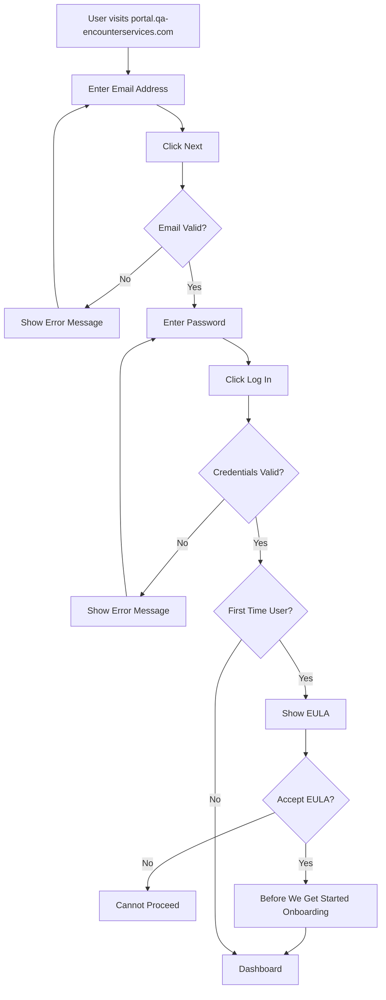

### 1.2 Device ID Login Flow

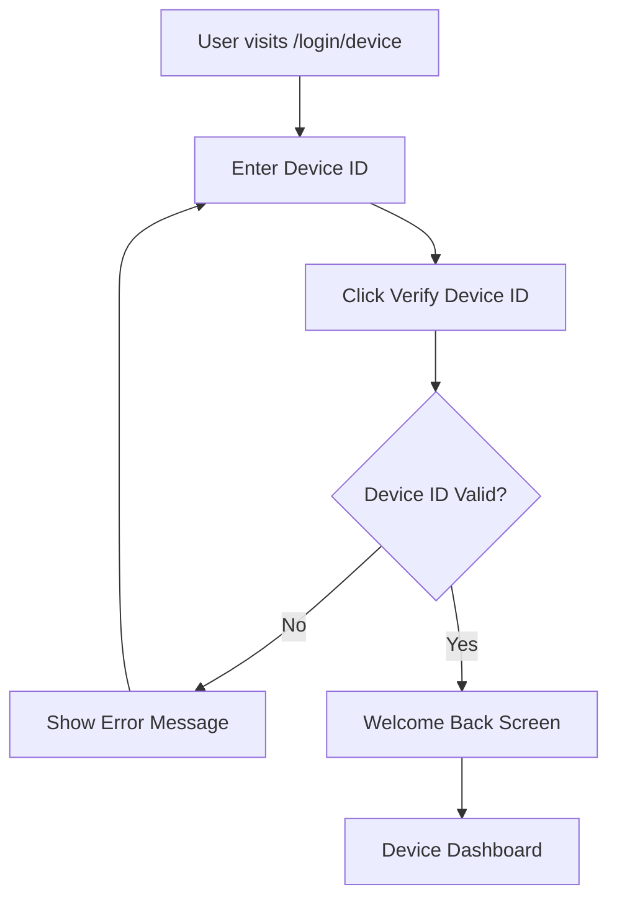

### 1.3 Password Reset Flow

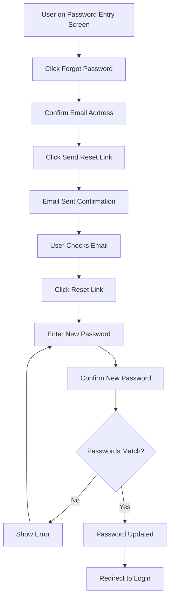

### 1.4 Account Creation Flow

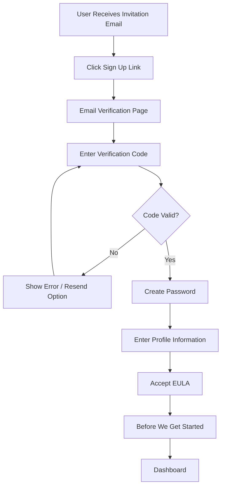

---

## 2. Session Workflows

### 2.1 Scheduled Appointment Flow (Patient Perspective)

> See screenshots: `workflow-scheduled-*.png`

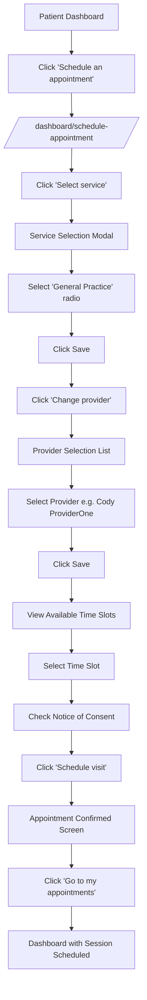

### 2.2 On-Demand Session Flow (Patient Perspective)

> See screenshots: `workflow-ondemand-*.png`

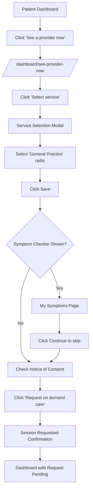

### 2.3 Provider On-Demand Availability

> See screenshots: `workflow-ondemand-01/02/03-*.png`

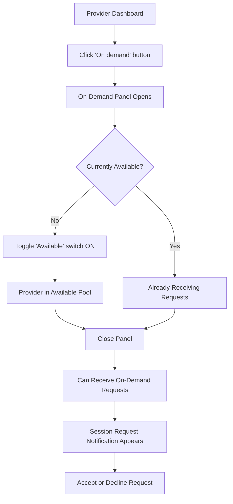

### 2.4 Session Details View (Provider)

> See screenshots: `workflow-session-*.png`

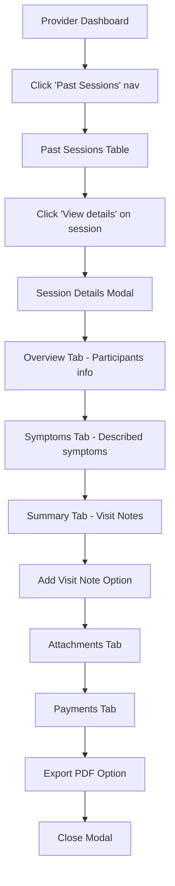

### 2.3 Session Join Flow

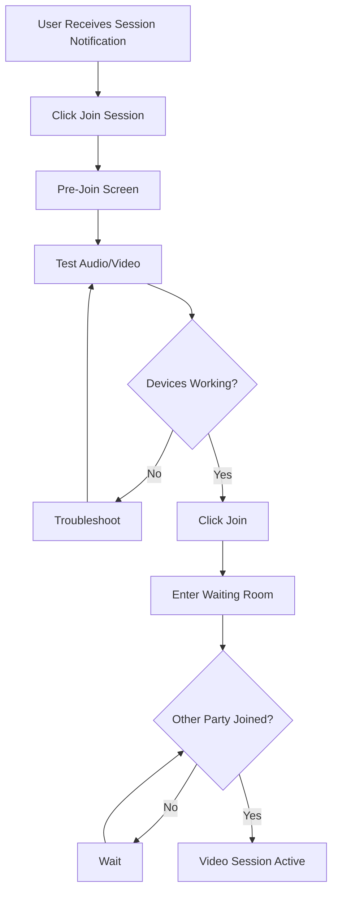

---

## 3. Admin Workflows

### 3.1 User Invitation Flow

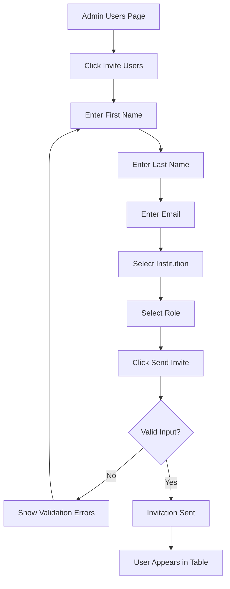

### 3.2 Device ID Creation Flow

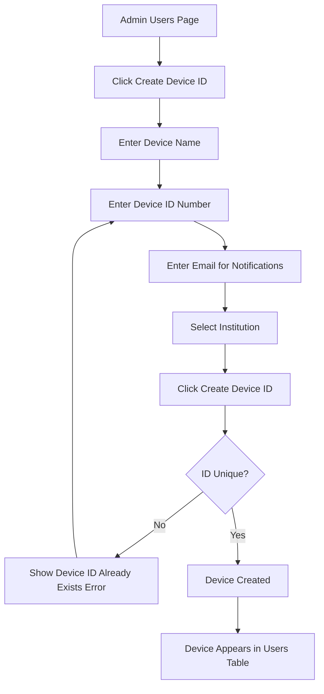

### 3.3 Institution Settings Configuration

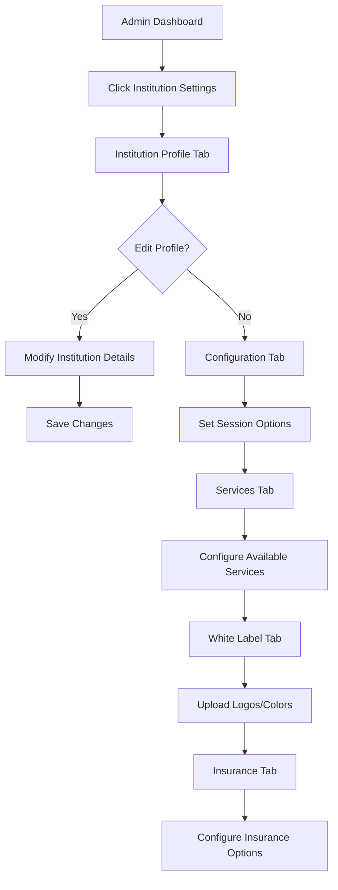

---

## 4. Coordinator Workflows

### 4.1 Command Center / Waiting Room Management

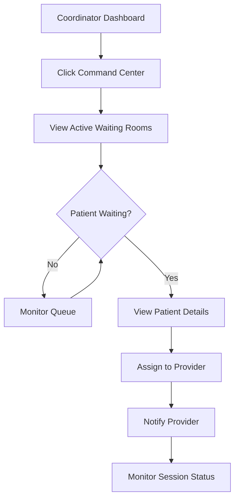

### 4.2 Session Scheduling (Coordinator)

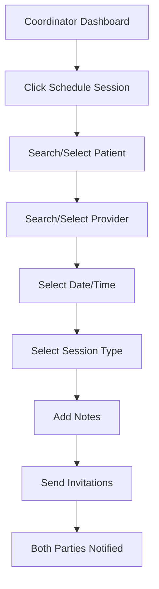

---

## 5. Provider Workflows

### 5.1 On-Demand Availability Toggle

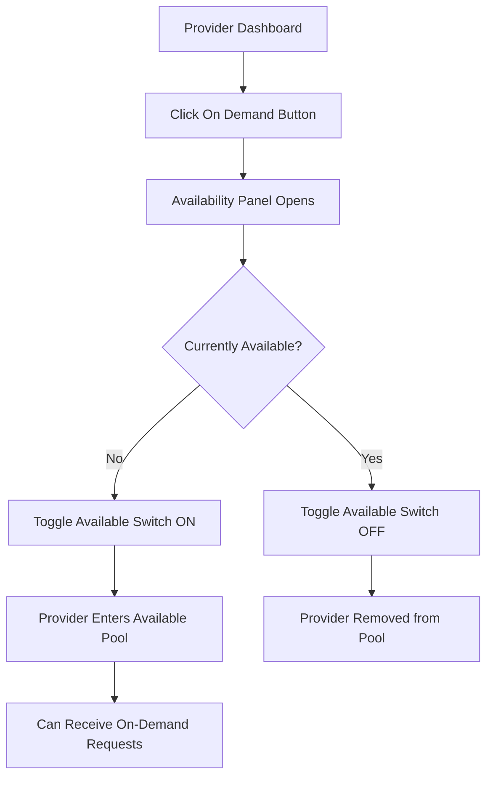

### 5.2 Visit Note Creation

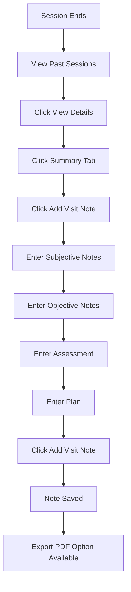

### 5.3 Calendar Availability Setup

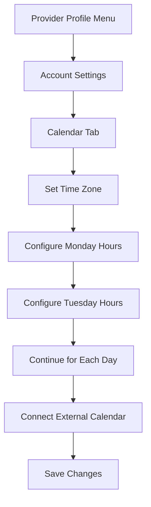

---

## 6. Patient Workflows

### 6.1 Health Profile Management

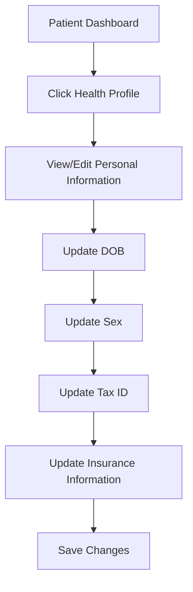

### 6.2 Vitals Scan Flow

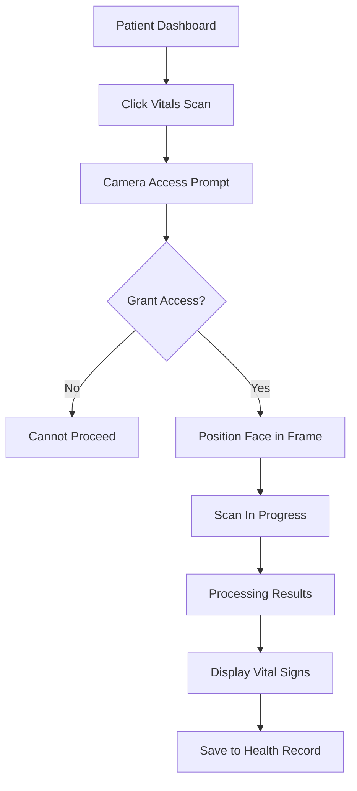

---

## 7. Notification Workflows

### 7.1 Notification Preferences Setup

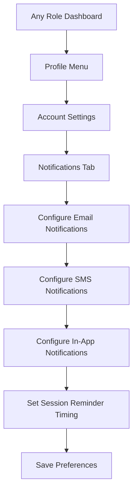

---

## 8. Role Navigation Summary

```mermaid
flowchart LR
    subgraph Admin
        A1[Users]
        A2[Institution Settings]
        A3[Document Management]
        A4[Visit Notes]
        A5[Data Reporting]
    end

    subgraph Provider
        P1[Dashboard]
        P2[Past Sessions]
        P3[Providers]
        P4[My Patients]
    end

    subgraph Patient
        PT1[Dashboard]
        PT2[Past Visits]
        PT3[Health Profile]
        PT4[Vitals Scan]
    end

    subgraph Coordinator
        C1[Dashboard]
        C2[Past Sessions]
        C3[Providers]
        C4[Patients]
        C5[Command Center]
    end

    subgraph Device
        D1[Dashboard Only]
    end
```

---

## 9. Account Settings Tabs by Role

```mermaid
flowchart TD
    subgraph All Roles
        MA[My Account Tab]
        NOT[Notifications Tab]
    end

    subgraph Provider Only
        CAL[Calendar Tab]
    end

    MA --> |Contains| MA1[Profile Photo]
    MA --> |Contains| MA2[Profile Details]
    MA --> |Contains| MA3[Language Selection]
    MA --> |Contains| MA4[Time Zone]
    MA --> |Contains| MA5[Delete Account]

    CAL --> |Contains| CAL1[Time Zone]
    CAL --> |Contains| CAL2[Daily Availability]
    CAL --> |Contains| CAL3[Calendar Integrations]

    NOT --> |Contains| NOT1[Email/SMS/In-App Toggle]
    NOT --> |Contains| NOT2[Session Reminders]
```

---

## Usage Notes

These diagrams can be:

1. Rendered in GitHub/GitLab markdown viewers
2. Converted to images using Mermaid CLI
3. Included in LaTeX documents using the `mermaid-filter` package
4. Exported as SVG/PNG for static documentation

To render locally:

```bash
npm install -g @mermaid-js/mermaid-cli
mmdc -i workflow-diagrams.md -o workflow-diagrams.pdf
```
